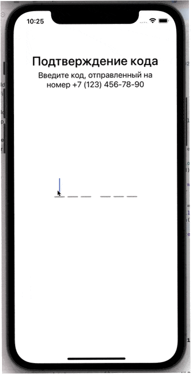

# SWCodeField

`SWCodeField` - простое поле для ввода кода подтверждения из смс или email с возможность изменения количества элементов. UI-элемент основан на `UIStackView`, объединяет в себе несколько текстовых полей и реализует логичное переключение между ними при вводе и удалении символов.



### Основные возможности

- Создание и настройка элемента с помощью кода.
- Создание и настройка элемента с помощью Storyboard (с отображением прямо в storyboard).
- Возможность настройки количества секций и элементов.
- Поддержка автоматической вставки кода из поступившего смс-сообщения.

### Требования

- iOS 14+
- UIKit (поддержки SwiftUI нет)

## Установка

### Swift Package Manager

#### Вариант 1.

- В Xcode перейдите к `File | Add Packages ...` и введите адрес `https://github.com/DobbyWanKenoby/SWCodeField` в поисковом поле.
- Укажите необходимую версию и нажмите `Add Package`.

#### Вариант 2.

Добавьте в качестве зависимости в файл `Package.swift` следующий код:

```
dependencies: [
    .package(url: "https://github.com/DobbyWanKenoby/SWCodeField", .upToNextMajor(from: "1.0"))
]
```

### Вручную

Добавьте в собственный проект код из файла Sources/SWCodeField/SWCodeField.swift

## Использование

### Использование с помощью Storyboard

- Добавьте на сцену элемент `UIStackView`.
- В качестве класса элемента укажите `SWCodeField`.
- В `Attributes Inspector` укажите количество блоков и элементов в блоках (текстовых полей).
- Свяжите графический элемент со свойством во вьюконтроллере.

```swift
@IBOutlet var codeField: SWCodeField!
```

- В программном коде задайте обработчик, который вызывается после заполнения всех текстовых полей (свойство `doAfterCodeDidEnter`).

```swift
codeField.doAfterCodeDidEnter = { code in
    print("Code is \(code)")
}
```

 ### Использование с помощью программного кода
 
- Создайте новый экземпляр типа `SWCodeField`, указав количество блоков и элементов.
 
```swift
let codeField = SWCodeField(blocks: 2, elementsInBlock: 3)
```
 
 - Укажите размер и расположение элемента любым удобным способом:
 
 Через frame
```swift
self.view.addSubview(codeField)
codeField.frame.size = CGSize(width: 200, height: 50)
codeField.center = view.center
```

С помощью SnapKit
```swift
codeField.snp.makeConstraints { make in
    make.centerY.centerX.equalToSuperview()
    make.leadingMargin.trailingMargin.equalTo(40)
    make.height.equalTo(50)
}
```
 
 - Задайте обработчик, который вызывается после заполнения всех текстовых полей (свойство `doAfterCodeDidEnter`).
 
```swift
codeField.doAfterCodeDidEnter = { code in
    print("Code is \(code)")
}
```

## API

```swift
// Замыкание, которое выполняется после того, когда введены значения для всех полей
// В качестве входного параметра получает введнный код в виде строки
var doAfterCodeDidEnter: ((String) -> Void)? { get set }

// Код в текстовых полях
// Может быть как прочитано, так и установлено
var code: String { get set }
```
 
## TODO

- Тесты.
- Обработка вставки скопированного текста.
- Настройка внешнего вида текстовых полей.
- Настройка внешнего вида линий.
- Настрйока шрифта.
- Различное количество элементво в блоках.
- Настройка разделителя между блоками (например символ `-` для кода типа `12-33-56`).
